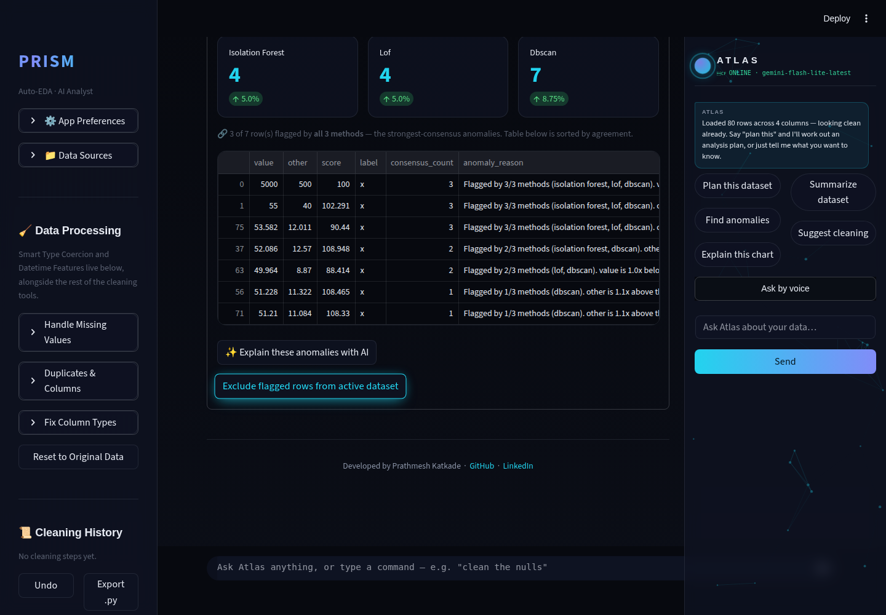
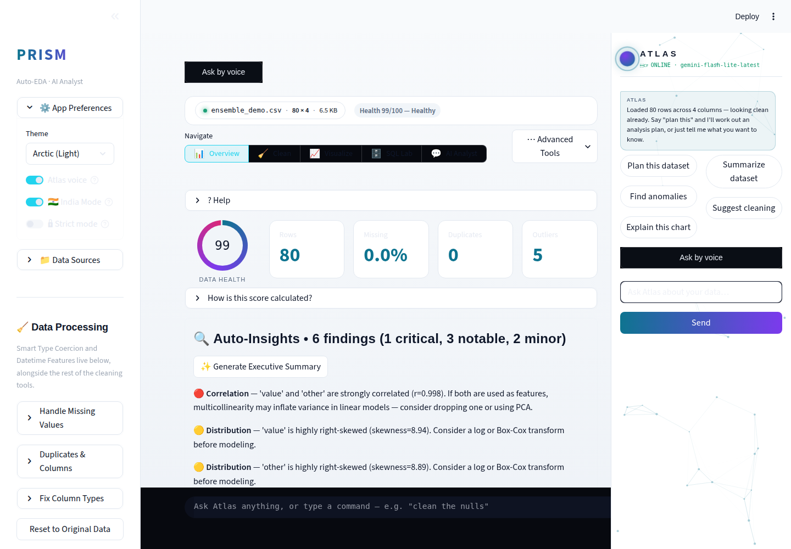
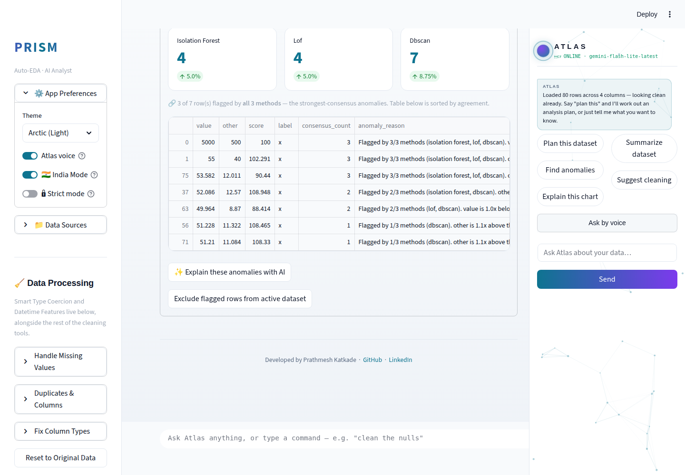
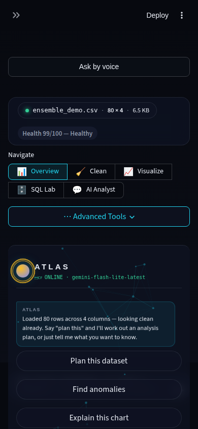
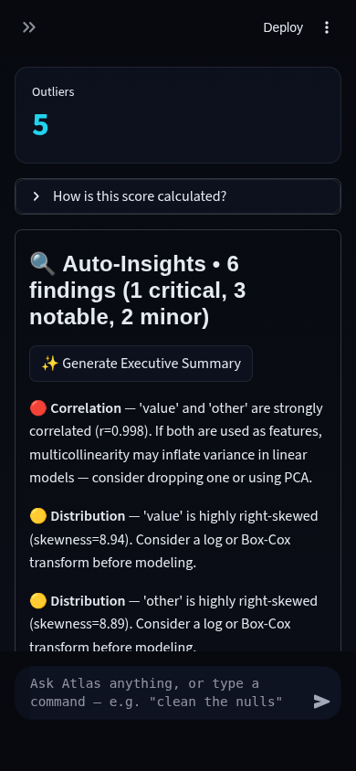

# Prism Autonomous Improvement Run — 2026-08-10 (Run 4)

Full-auto run per `.prism/routine_log.md`'s standing instructions. Second
independent session on this date (Run 3's report is
`RUN_REPORT_2026-08-10.md`). One feature shipped, bundled with two small
fixes carried over from Run 3's own "recommendation for next run" list.
Branch merged to `main`, tested, and pushed.

## 1. What shipped

### Ensemble Anomaly Consensus (agentic-AI theme — required this cycle)

**What it does:** In Overview's Anomaly Detection panel, a new "Ensemble
mode — cross-check with LOF + DBSCAN" checkbox runs three anomaly
detectors with genuinely different assumptions over the same numeric
columns — Isolation Forest (global isolation via random recursive
splits), Local Outlier Factor (local density — flags points in sparser
neighborhoods than their neighbors), and DBSCAN (density-based
clustering — anything outside a dense cluster). Every flagged row carries
a `consensus_count` (1-3, how many methods agree) and the table sorts by
agreement, with per-method metric cards showing each detector's flagged
count. A "✨ Explain these anomalies with AI" button asks Gemini to
interpret what the agreement/disagreement pattern suggests — a few
extreme global outliers vs. local pockets of unusual density — and
suggest one concrete next action.

**Why chosen:** "Advanced outlier detection (LOF, DBSCAN)" has been on
the backlog since 2026-08-07 Run 2, flagged each subsequent run as
"needs its own eval harness to present method disagreement sensibly."
This run built exactly that harness. Before selecting it, checked whether
the other open backlog item — "Data Quality Score with exportable
scorecard" — was really still open: it wasn't. `data_engine.py` already
has a comprehensive weighted Data Health Score with PDF export via
`report_writer.py`; three prior runs' backlogs had this wrong. Caught
during this run's research phase, not after building a duplicate.

**Technical-depth argument:** This is the self-verifying-agent pattern
applied to anomaly detection — instead of trusting one model's opinion,
cross-check it against models built on different mathematical
assumptions (global isolation vs. local density vs. density-connectivity)
and surface *how much they agree*, not just what any one of them found.
The detection stays fully deterministic and auditable (three independent
sklearn models, no LLM in the loop); Gemini's only job is the
interpretive step — turning "IsoForest flagged 4, LOF flagged 4, DBSCAN
flagged 7, only 3 rows had unanimous agreement" into an explanation a
non-technical stakeholder can act on. DBSCAN's `eps` parameter is
auto-tuned via a k-distance-percentile heuristic rather than a magic
number, so it's not silently miscalibrated to whatever dataset it's run
against.

## 2. Bundled small fixes

### Light-theme dataframe styling

**The bug:** Overview's "Missing Values by Column" / "Outliers (IQR
method)" tables — and every other `st.dataframe`/`st.table` in the app —
kept dark row/header styling even when the Arctic (Light) theme was
active. Flagged as an unresolved finding in Run 3's report.

**Root cause:** `st.dataframe` renders through glide-data-grid, a
`<canvas>` element. Canvas fill colors come from Streamlit's
`theme.base`/`backgroundColor`/etc. *runtime config*, not from any CSS
this app injects — `.streamlit/config.toml` sets those once, hardcoded to
dark, and the in-app theme toggle only ever updated injected CSS + the
Plotly template, never that config. Confirmed live via
`st._config.get_option`.

**Fix:** `theme.sync_native_theme()` pushes the active theme's colors
into Streamlit's runtime config via `st._config.set_option` on every
rerun, guarded in a try/except (it's a private API with no public
equivalent as of Streamlit 1.50) so a future Streamlit version that
removes it degrades to "dataframes stay dark," never a crash.

### Mobile Atlas panel overlap (~390px)

**The bug:** flagged by two prior runs as "the Atlas side panel doesn't
reflow, squeezes main content into an unreadable strip." This run
initially applied the fix that description suggests — a media query on
`.st-key-atlas_side_panel` making it `position: static` under 768px — and
the screenshot still looked exactly as broken.

**Real root cause (two independent rules, not one):** `app.py`'s Atlas
panel render block separately injects
`` to
reserve horizontal room for the panel's normally-fixed 328px width — also
completely unconditional, no media query, living in a different file from
the panel's own CSS. On a ~390px viewport this alone left `390 - 352 - 16
(left padding) ≈ 22px` for all main content, regardless of what the
panel's own CSS did. Confirmed by reading `stMainBlockContainer`'s live
computed `padding` (`96px 352px 120px 16px`) via Playwright rather than
continuing to guess from screenshots alone.

**Fix:** both rules now share the same 768px breakpoint — under it, the
padding reservation drops to 0 and the panel stacks below main content
instead of overlapping it.

**Lesson logged for future runs:** when a CSS fix doesn't visibly change
a broken screenshot, inspect live computed styles/bounding boxes before
concluding the fix is wrong or the bug is somewhere else entirely — a
screenshot alone doesn't explain *why* a layout is broken.

## 3. Screenshots

Captured via `.prism/runs/2026-08-10/screenshot_run4.py` (Playwright,
headless Chromium) against a locally running instance, using a crafted
80-row, 3-numeric-column CSV (`ensemble_demo.csv`) with a planted global
outlier (all 3 methods agree) and a planted local-density outlier
(LOF/DBSCAN-only).

**Ensemble Anomaly Consensus panel — desktop, dark:**

**Overview dataframes now correctly light-themed — desktop, light (Arctic):**

**Ensemble Anomaly Consensus panel — desktop, light:**

**Mobile Atlas panel — properly stacked below main content, not
overlapping — mobile, dark:**

No live-Gemini-output screenshot of the ensemble disagreement narration
text — fourth consecutive run with no `GEMINI_API_KEY` configured in this
sandbox. The graceful fallback ("I can't reach Gemini right now — no API
key is configured") rendered correctly rather than crashing, visible in
the desktop screenshots' Atlas chat log. Narration logic covered by 3 unit
tests using a fake model object.

## 4. Research findings NOT built (backlog)

See `.prism/research_2026-08-10-run4.md` for full evidence. Unchanged
from Run 3 except the two items this run closed:

| Feature | Depth | Effort | Why not this run |
|---|---|---|---|
| polars/DuckDB large-file backend | 5 | L | Architecture-adjacent; four consecutive runs now agree it needs a dedicated session |
| Feature Selection Engine (mutual info/RFE/L1) for ML Lab | 4 | M | Not this cycle's required theme; queued |
| `google-generativeai` → `google-genai` migration | 2 (hygiene) | M | Touches 4 Gemini call sites; three consecutive runs agree it needs a dedicated regression-tested session |

## 5. Interview notes (STAR-style, verbatim-usable)

**Ensemble Anomaly Consensus:**
> "Rather than trusting a single anomaly-detection model, I built an
> ensemble of three detectors with genuinely different mathematical
> assumptions — Isolation Forest for global isolation, Local Outlier
> Factor for local density, DBSCAN for density-connectivity — and
> surfaced their agreement as a first-class signal, not just their union.
> A row flagged by all three is a much stronger claim than a row flagged
> by one. I kept the detection deterministic and auditable and used
> Gemini only for the interpretive layer — explaining what the agreement
> pattern suggests about the kind of anomaly present."

**Mobile layout bug fix:**
> "Two prior audit passes had flagged a mobile layout bug and described
> a single cause. When I applied the fix their description implied, the
> screenshot didn't change at all. Instead of assuming the bug was
> somewhere else, I inspected the live computed CSS on the actual broken
> element and found a second, completely independent rule — in a
> different file — also reserving space for the same panel, unconditionally.
> Both had to be fixed together. I documented the false lead explicitly so
> the next person doesn't repeat the same partial diagnosis."

**Caught a stale backlog item before building a duplicate:**
> "Before starting a 'Data Quality Score' feature that had been on our
> backlog for three runs, I checked the codebase directly instead of
> trusting the backlog description — the scoring and PDF export already
> existed under a different name. I redirected effort to a genuinely
> unbuilt item instead of shipping a duplicate that would have looked like
> progress without being any."

## 6. Recommendation for next run

1. **polars/DuckDB large-file backend** — highest-depth item still open,
   four runs running; worth a dedicated session rather than continuing to
   defer it every cycle.
2. **`google-generativeai` → `google-genai` migration** — the
   `FutureWarning` fires on every single test run now; still low urgency
   functionally but the warning noise itself is starting to be a
   code-quality smell in its own right.
3. If a Gemini API key becomes available, prioritize screenshotting real
   narration output (anomaly, ensemble-disagreement, Auto-Insights) —
   four runs in a row have shipped Gemini-dependent UI never visually
   confirmed with real model output.
4. Feature Selection Engine (mutual info/RFE/L1) for ML Lab remains the
   next-best pure-ML-depth pick if a run wants a non-agentic-theme feature
   alongside a required agentic one.
