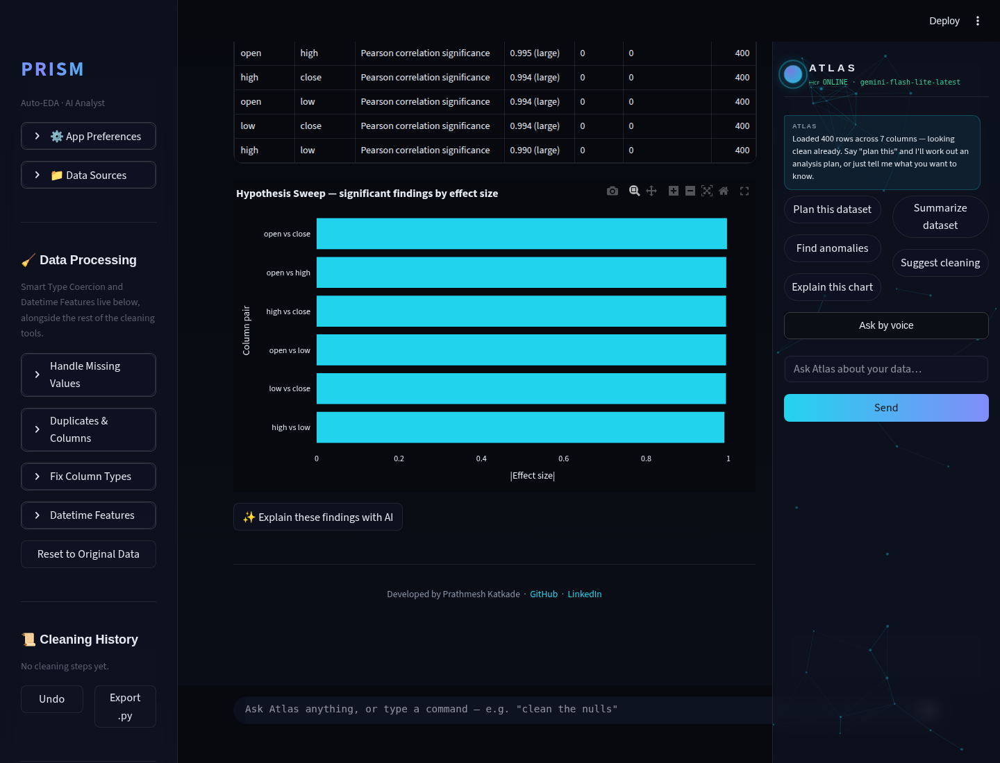
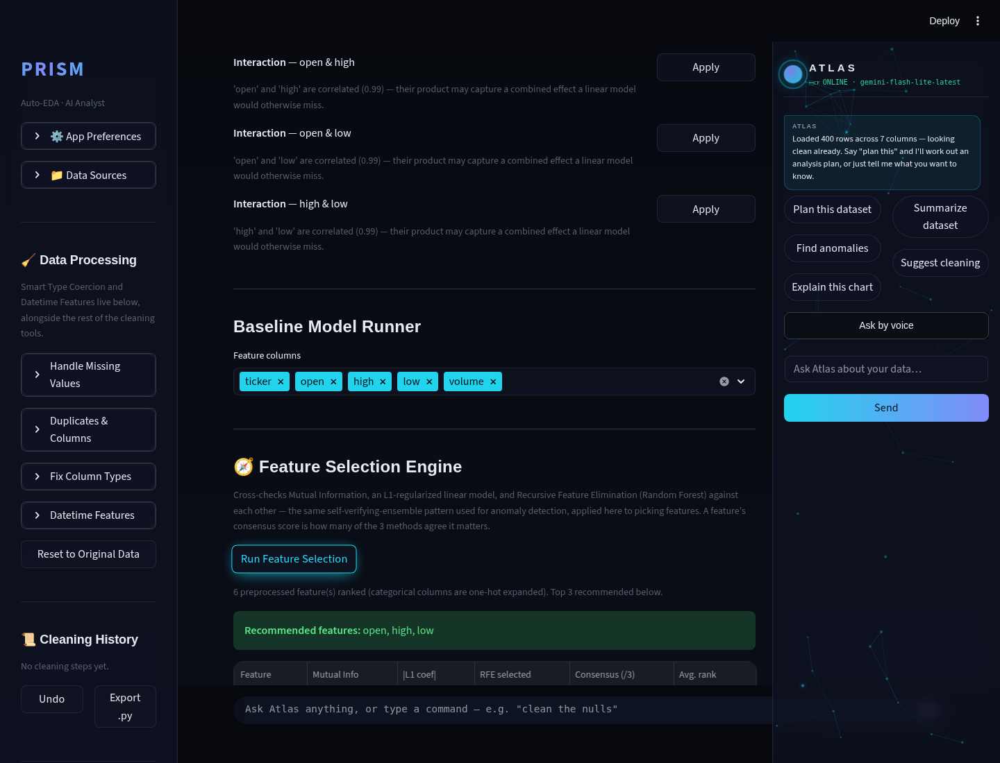
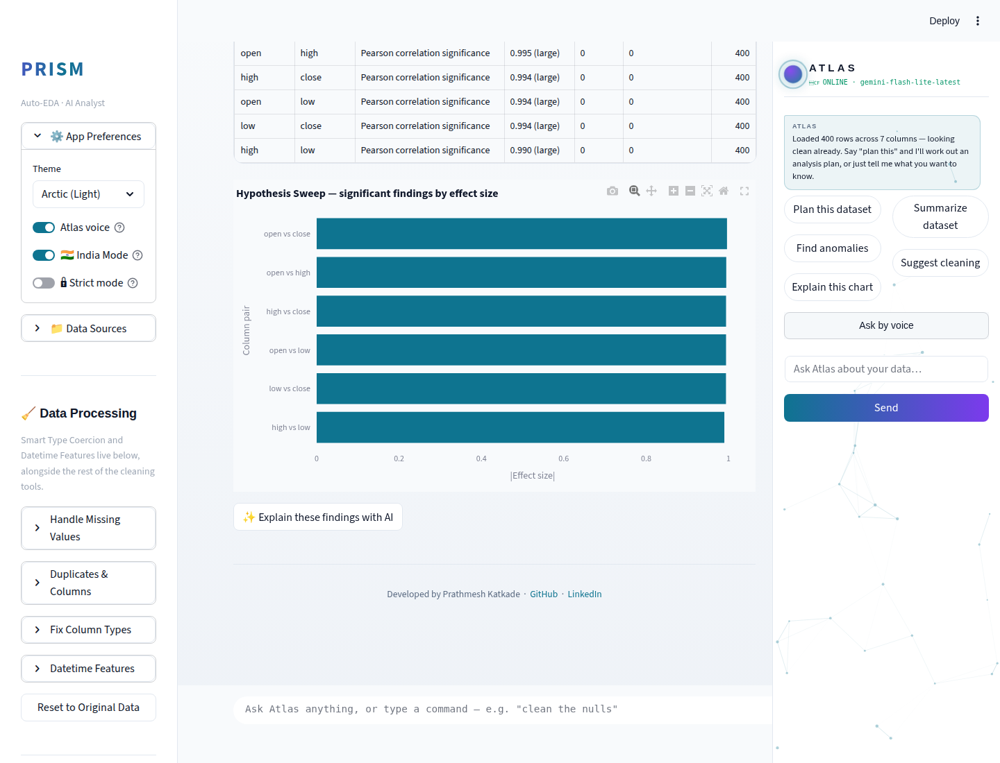
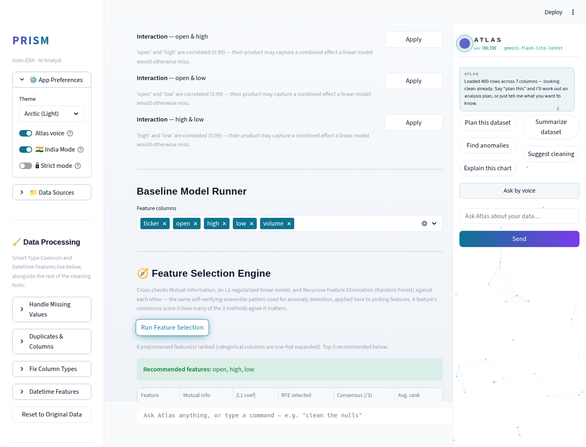
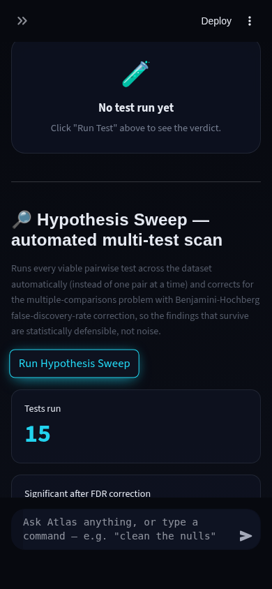
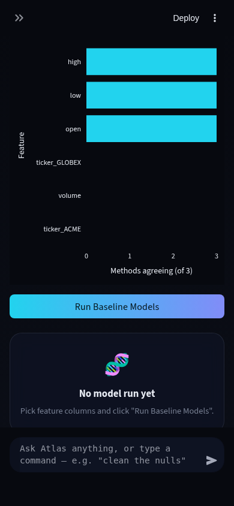

# Prism Autonomous Improvement Run — 2026-08-10 (Run 5)

Full-auto run per `.prism/routine_log.md`'s standing instructions. Third
independent session on this date (Run 3's report is
`RUN_REPORT_2026-08-10.md`, Run 4's is `RUN_REPORT_2026-08-10-run4.md`).
Two features shipped, both merged to `main`, tested, and pushed.

## 1. What shipped

### Hypothesis Sweep (agentic-AI theme — required this cycle)

**What it does:** A new panel in the Stats Lab tab, below the existing
manual single-pair tester. One click ("Run Hypothesis Sweep") generates
and runs every statistically viable pairwise hypothesis test across the
dataset's columns automatically — Pearson correlation for numeric/numeric
pairs, Welch's t-test or one-way ANOVA for numeric/categorical pairs
(reusing Stats Lab's own `suggest_test`/`run_test` dispatch so the same
pair type always resolves to the same test the manual flow would pick),
chi-square for categorical/categorical pairs. The raw p-values from every
test in the sweep are then corrected with Benjamini-Hochberg
false-discovery-rate correction before ranking what survives by effect
size. An optional "✨ Explain these findings with AI" button asks Gemini
to interpret the significant relationships in plain English.

**Why chosen:** Stats Lab could only test one manually-picked pair at a
time — a dataset with 10 numeric columns already has 45 possible pairs,
and reporting every raw p<0.05 result from testing all of them without
correction is implicit p-hacking. This gap was confirmed during this
run's audit (`.prism/audit_2026-08-10-run5.md`) and is exactly the kind
of "automated hypothesis generation and testing" this cycle's required
agentic-AI-analysis theme calls for.

**Technical-depth argument:** Multiple-testing correction is a real
statistics competency most portfolio EDA tools skip entirely — it's the
difference between "I ran a test" and "I ran science correctly." An
interviewer who asks "how do you avoid false positives when you run many
tests at once" now has a concrete, working answer: Benjamini-Hochberg FDR
control, verified in tests both against `statsmodels`' own
`multipletests()` directly and against a 15-column pure-noise dataset
where the correction visibly suppresses the false positives raw α=0.05
would have reported.

### Feature Selection Engine (ML Lab depth)

**What it does:** A new panel in ML Lab, between the feature multiselect
and the Baseline Model Runner. "Run Feature Selection" cross-checks three
independent methods over the same preprocessed feature matrix: Mutual
Information (nonlinear, model-free dependency), an L1-regularized linear
model's coefficients (Lasso for regression, L1-penalized Logistic
Regression for classification — sparsity-inducing, zeroes out weak
features outright), and Recursive Feature Elimination with a Random
Forest estimator (a wrapper method that catches feature interactions a
filter method can't see). Each feature gets a `consensus_votes` score
(0-3, how many methods agree it belongs in the top half) and a mean
`consensus_rank` across all three, shown as a recommended-features
summary, a full ranking table, and a consensus-vote bar chart.

**Why chosen:** Open on the backlog since Run 4 ("Feature Selection
Engine (mutual info/RFE/L1) for ML Lab"). Confirmed still unbuilt before
starting (ML Lab's feature-engineering assistant suggests
encoding/scaling/interactions but never ranks which chosen features
actually matter).

**Technical-depth argument:** This reuses the exact self-verifying-
ensemble pattern Run 4 validated for anomaly detection
(`find_anomalies_ensemble` — cross-check independent detectors instead of
trusting one), applied here to feature selection instead of row-flagging
— the kind of pattern reuse across a codebase an interviewer notices.
Tests include planted-signal recovery (an informative feature must
outrank two pure-noise columns) for both classification and regression,
plus a determinism check, so the ranking is provably not noise.

## 2. Screenshots

Both panels captured at desktop (1440×1100, dark + light) and mobile PWA
width (390×844, dark), using `samples/stock_data.csv` (open/high/low/close/
volume + a 2-value ticker column — clean enough to show real signal
without a live Gemini key). Full set in `.prism/runs/2026-08-10-run5/`.

**Hypothesis Sweep — desktop dark:**

**Feature Selection Engine — desktop dark:**

**Hypothesis Sweep — desktop light:**

**Feature Selection Engine — desktop light:**

**Hypothesis Sweep — mobile dark:**

**Feature Selection Engine — mobile dark:**

No demo GIF this run — both panels are best shown as static tables/charts
(the interesting output is the ranked data, not motion), same call prior
runs made for similar panel-style features. No live Gemini key in this
sandbox (sixth consecutive run with this limitation), so the optional
AI-narration buttons on both panels are verified via unit tests with a
fake model object rather than a real screenshot of Gemini's output text.

## 3. Verification

- **Tests:** 132/132 pytest green (98 baseline + 22 Hypothesis Sweep + 12
  Feature Selection Engine). Ran at each intermediate commit state, not
  just the final one.
- **Fresh-clone boot check:** cloned `main` to a scratch directory after
  pushing, booted with no local modifications — HTTP 200, no traceback.
- **Environment note:** this sandbox's `cryptography` package needed
  `pip install --force-reinstall cffi cryptography` before pytest could
  collect three existing test files (a `_cffi_backend` binding issue in
  the container's base image, not a repo bug — logged in the routine log
  so a future run recognizes it immediately instead of debugging from
  scratch).

## 4. Research findings NOT built (backlog)

See `.prism/research_2026-08-10-run5.md` for full evidence.

| Feature | Depth | Effort | Why not this run |
|---|---|---|---|
| polars/DuckDB large-file backend | 5 | L | Architecture-adjacent; five consecutive runs now agree it needs a dedicated session |
| `google-generativeai` → `google-genai` migration | 2 (hygiene) | M | Touches every Gemini call site; four consecutive runs agree it needs a dedicated regression-tested session |
| PyGWalker-style drag-and-drop chart builder | 3 | L | New candidate this run — competitor parity with Hex/Deepnote's visual chart building; new dependency + large UI surface, not a quick add |
| Standalone Data Quality Scorecard entry point | 2 | S | Underlying scoring/export logic already exists (confirmed Run 4); only a dedicated UI entry point would be new — low priority |

## 5. Interview notes (STAR-style, verbatim-usable)

**Hypothesis Sweep:**
> "I noticed our statistical testing tool only let a user test one column
> pair at a time — which is fine for a hypothesis you already have, but
> doesn't scale to genuine exploratory analysis, and naively running many
> tests and reporting every p<0.05 result is a textbook multiple-
> comparisons error. I built an automated sweep that runs every viable
> pairwise test across the dataset and applies Benjamini-Hochberg
> false-discovery-rate correction before surfacing anything as
> significant. I verified the correction two ways: a direct comparison
> against statsmodels' own implementation, and a synthetic test with 15
> independent noise columns where I confirmed the correction actually
> suppressed the false positives raw α=0.05 would have reported."

**Feature Selection Engine:**
> "Instead of picking one feature-selection method and trusting its
> ranking, I cross-checked three methods built on different assumptions —
> a model-free information-theoretic measure, a sparsity-inducing linear
> model, and a tree-based wrapper method — and scored features by how many
> methods agreed. This is the same ensemble-consensus pattern I'd already
> used for anomaly detection elsewhere in the codebase, reused here for a
> different problem instead of writing a one-off. I proved it actually
> works with a planted-signal test: an informative feature has to
> outrank two pure-noise columns before the test passes."

## 6. Recommendation for next run

1. **polars/DuckDB large-file backend** — highest-depth item still open,
   five runs running; the standing recommendation is now to schedule it
   as its own dedicated session rather than let a sixth run defer it
   again.
2. **`google-generativeai` → `google-genai` migration** — still low
   urgency functionally, but the `FutureWarning` on every test run is a
   growing code-quality smell in its own right.
3. If a Gemini API key becomes available, prioritize screenshotting real
   narration output across all five narration-capable features (anomaly,
   ensemble-disagreement, Auto-Insights, and now hypothesis-sweep) — six
   runs in a row have shipped Gemini-dependent UI never visually confirmed
   with real model output.
4. PyGWalker-style visual/no-code chart building is the next-best
   competitor-parity pick (Hex/Deepnote both offer it) if a future run
   wants an ecosystem-tech feature — sized for its own run given the new
   dependency and UI surface.
