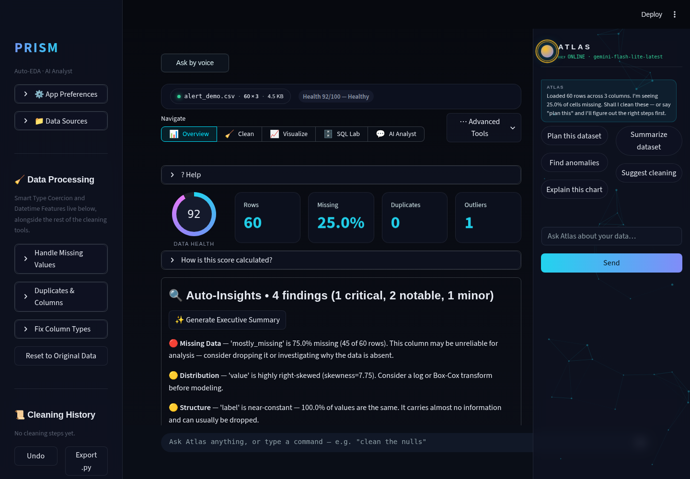
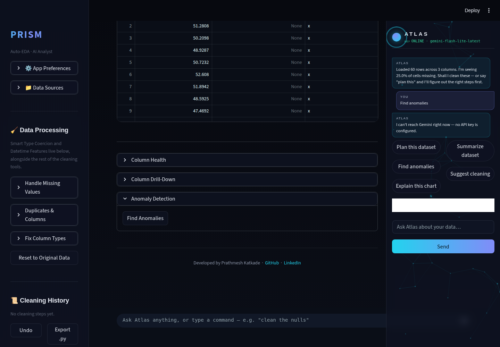
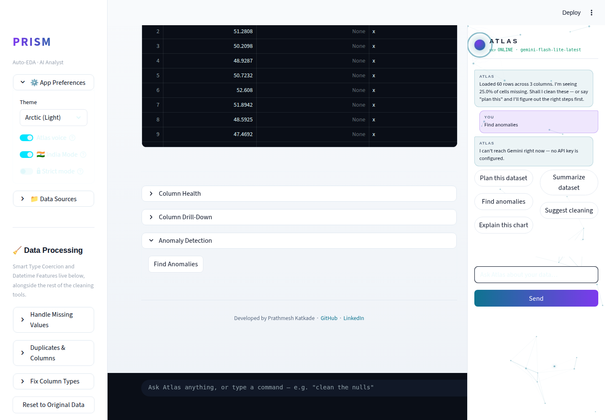
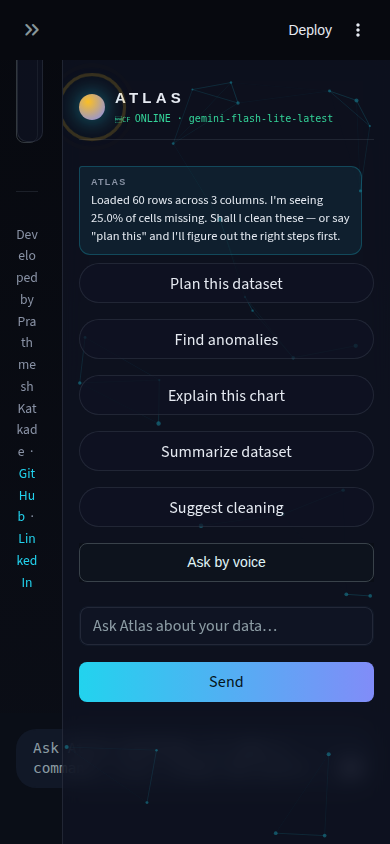

# Prism Autonomous Improvement Run — 2026-08-10

Full-auto run per `.prism/routine_log.md`'s standing instructions. Two
features shipped plus one bundled small fix (test-coverage gap) and one
bug fix discovered during Phase 5 verification. All branches merged to
`main`, tested, and pushed.

## 1. What shipped

### Anomaly narration (agentic-AI theme — required this cycle)

**What it does:** In the Overview tab's Anomaly Detection panel, after
IsolationForest flags unusual rows, a new "✨ Explain these anomalies with
AI" button asks Gemini to explain the pattern in plain English — is this
likely data-entry error or a genuine rare event? — and suggests one
concrete next action. The narration is cached against a fingerprint of
the exact flagged set (row count + index/reason hash), so switching tabs
and coming back doesn't burn another free-tier Gemini call for a result
already shown.

**Why chosen:** Both 2026-08-07 runs' backlogs flagged this as open —
`anomaly.py` had templated reason strings but no narration layer. This
cycle's priority theme requires an agentic-AI feature; this was the
highest-evidence, lowest-risk candidate (see `.prism/research_2026-08-10.md`).

**Technical-depth argument:** It's the "insight discovery" step from the
agentic-EDA research pattern (arXiv 2508.02744) applied concretely: a
statistical detector (IsolationForest over numeric columns) hands its
raw output to an LLM step whose only job is *interpretation*, not
detection — keeping the actual anomaly-finding deterministic and
auditable while using the LLM for what LLMs are actually good at. The
caching-by-fingerprint design is a direct, deliberate response to the
routine's "design for rate-limit handling and caching" constraint, not
an afterthought.

### Atlas proactive alert HUD (JARVIS-copilot track, ≤1/run cap)

**What it does:** Atlas's orb gains a new `alert` visual state — an amber
double-ring pulse with a "⚠ N new insight(s)" label — that appears
**unprompted** the moment a freshly uploaded dataset contains a
high-severity Auto-Insight finding (severe missing data, high duplicate
rate, etc.). No button click, no question asked. It clears the next time
the user actually views the Overview tab's findings.

**Why chosen:** Backlog item from both 2026-08-07 runs ("Atlas Proactive
Insights" / JARVIS track), never built. The routine caps JARVIS-track
features at one per run — this is a genuinely incremental slice (a new
orb state plus the wiring to trigger it), not the full copilot vision.

**Technical-depth argument:** Zero additional Gemini calls — it's pure
reuse of a computation (`auto_insights.generate_insights()`) the app
already runs on every upload, surfaced as an unprompted signal instead of
a scrollable list the user has to notice themselves. That reuse-not-
recompute design, plus the same-run self-clear bug this run's own
verification caught and fixed (see below), is exactly the kind of subtle
Streamlit state-timing issue that's easy to gloss over and worth being
able to explain in an interview.

### Bundled small fix: backfilled test coverage (42 tests)

`CHANGELOG.md` and `routine_log.md` both claimed the 2026-08-07 run
shipped 82 tests for `auto_insights`, `regression_diagnostics`, and STL
decomposition. `git log --all -- tests/` proved otherwise — those tests
were never committed. Found during this run's audit, treated as a small
fix rather than re-litigated: 42 tests backfilled covering the main
detector/fit/diagnostic paths plus empty/single-row/collinear/
heteroscedastic edge cases (see `tests/test_auto_insights.py`,
`tests/test_regression_diagnostics.py`, `tests/test_forecasting_stl.py`).

## 2. Bug found and fixed during verification

Phase 5's screenshot check on the alert HUD found it wasn't actually
visible: the side panel's small header orb had sizing CSS but no
background/gradient/animation rules — those live in a block only injected
by `render_orb()`, which is skipped once a dataset is active (the side
panel replaces the floating orb). This was a **pre-existing** issue
affecting every orb state, not something this run's feature introduced —
it had just never been visually checked closely before. Fixed by
extracting `atlas.inject_orb_css()` and calling it from both render paths.
A second bug (the alert clearing itself in the same script pass it was
raised in, since Overview is the default tab) was fixed alongside with a
one-run grace flag. See `9f6a632` for the full fix and reasoning.

## 3. Screenshots

All captured via `.prism/runs/2026-08-10/screenshot_features.py`
(Playwright, headless Chromium) against a locally running instance, using
a small crafted CSV (`alert_demo.csv`) with a 75%-missing column to
reliably trigger the high-severity alert path.

**Orb alert state — desktop, dark:**

**Anomaly Detection panel with the new narration button — desktop, dark:**

**Orb alert state — desktop, light (Arctic theme):**

**Anomaly Detection panel — desktop, light:**

**Orb alert state — mobile, dark:**

No live-Gemini-output screenshot of the anomaly narration text itself —
this sandbox has no configured `GEMINI_API_KEY` (same documented
limitation as both 2026-08-07 runs). The graceful fallback message
("I can't reach Gemini right now — no API key is configured") was
incidentally exercised during screenshot capture and rendered correctly
rather than crashing — a small positive signal for the app's error
handling. Narration logic itself is covered by 6 unit tests using a fake
model object standing in for the Gemini client.

The mobile screenshot also reconfirms a bug flagged (not caused) by
2026-08-07 Run 2: at ~390px width the Atlas side panel doesn't reflow and
squeezes main content into an unreadable vertical sliver. Still open,
still flagged for a dedicated CSS-reflow pass — not touched this run.

No demo GIF this run — both shipped features are best shown as static
before/after state (an orb color change, a new button) rather than a
multi-step interaction; the screenshots above cover it more clearly than
a recording would.

## 4. Research findings NOT built (backlog)

See `.prism/research_2026-08-10.md` for full evidence/scoring. Ranked,
highest depth first:

| Feature | Depth | Effort | Why not this run |
|---|---|---|---|
| polars/DuckDB large-file backend | 5 | L | Architecture-adjacent (touches `data_engine.py` pipeline-wide); flagged for a dedicated run by both prior runs, reconfirmed here |
| Feature Selection Engine (mutual info/RFE/L1) for ML Lab | 4 | M | Not this cycle's priority theme; queued |
| Advanced outlier detection (LOF, DBSCAN) | 4 | M | Needs its own eval harness to present method disagreement sensibly; queued |
| Data Quality Score with exportable scorecard | 3 | M | Lower urgency than the agentic-theme picks this cycle |
| `google-generativeai` → `google-genai` migration | 2 (hygiene) | M | Touches 4 Gemini call sites; needs a dedicated run with full regression testing, not a rushed patch |
| Light-theme dataframe styling on Overview (new finding) | — | S | Discovered during this run's own screenshot review; small fix, queued for next run |

## 5. Interview notes (STAR-style, verbatim-usable)

**Anomaly narration:**
> "I built a self-verifying anomaly pipeline where an IsolationForest
> model does the actual outlier detection — deterministic, auditable,
> no LLM involved — and Gemini's role is strictly interpretation: turning
> 'these 12 rows got flagged' into 'this looks like data-entry error in
> one field, here's what I'd check first.' I cached the narration by a
> fingerprint of the flagged set specifically because Gemini's free tier
> has rate limits, so re-viewing the same result never re-spends a call."

**Atlas proactive alert HUD:**
> "I found and fixed a real bug in my own feature during code review
> before shipping it: the alert I'd built to prove out 'proactive,
> unprompted' insight surfacing was clearing itself in the same script
> pass it was raised in, because Streamlit re-executes top-to-bottom and
> the default tab happened to contain both the trigger and the clear
> condition. I traced it with a one-run grace flag rather than papering
> over it with a delay, and wrote tests that specifically cover the
> same-run-vs-later-run distinction so it can't regress silently."

**Backfilled test coverage:**
> "During a routine audit I found our own changelog had over-claimed test
> coverage — three modules with zero actual committed tests despite the
> report saying 82. Rather than just noting it, I treated it as a bug and
> backfilled 42 real tests covering the statistical edge cases that
> matter (heteroscedasticity, collinearity, empty/single-row inputs) —
> because a portfolio project's credibility rests on its claims matching
> its repo, not on the changelog reading well."

## 6. Recommendation for next run

1. **Fix the mobile Atlas panel overlap** (~390px viewport) — reconfirmed
   present in this run's own screenshots, flagged by two prior runs now.
   It's a real "app breaks in a live demo" risk on an actual phone.
2. **Light-theme dataframe styling** on Overview's Missing-Values/Outliers
   tables — small, self-contained, found this run.
3. If a Gemini API key becomes available in the execution sandbox, redo
   the anomaly-narration and Auto-Insights-narration screenshots with the
   real LLM output visible — three runs in a row have now shipped
   Gemini-dependent features never visually confirmed end-to-end.
4. Consider the polars/DuckDB large-file backend as a **dedicated**
   run (not squeezed alongside feature work) given its architecture-wide
   blast radius — it's the highest-depth item still on the backlog.
