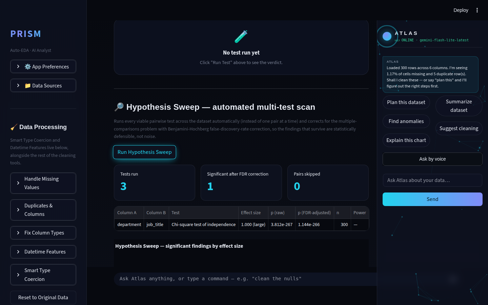
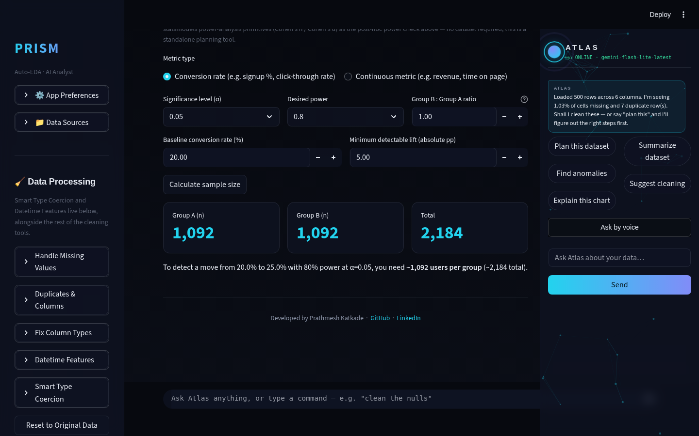
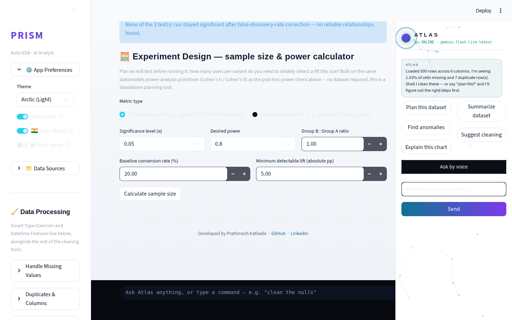
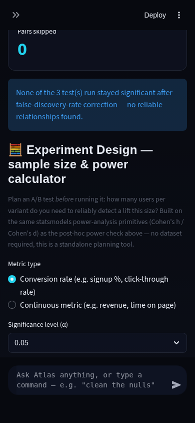

# Prism Autonomous Improvement Routine — Run Report

**Date:** 2026-08-11 (Run 25)
**Branch shipped:** `feature/experiment-design-power-lab` → merged into `main` (`--no-ff`), pushed.
**Full test suite:** 454 → **486/486 green**, zero regressions.

---

## 1. What shipped

### Experiment Design — A/B test power/sample-size calculator + underpowered-result detection

**What it does.** Two things, one coherent feature:

1. **Pre-experiment planning.** A new "🧮 Experiment Design" calculator in the Stats Lab tab
   answers "how many users per variant do I need to reliably detect a lift this size?" for
   both conversion-rate tests (`sample_size_two_proportions()`, Cohen's h via statsmodels'
   `NormalIndPower`) and continuous-metric tests (`sample_size_two_means()`, Cohen's d via
   `TTestIndPower`) — baseline rate/MDE or mean-diff/std-dev inputs, α/power/allocation-ratio
   controls, output in users-per-group and total.
2. **Post-hoc power checking, wired into the existing Hypothesis Sweep.** Every significant
   t-test row the sweep finds now gets a "Power" badge (✅ well-powered / ⚠️ underpowered, with
   the achieved-power percentage), and an expandable panel explains in plain English which
   "significant" findings actually had too small a sample to trust — plus the sample size a
   follow-up study would need to reach 80% power for that same effect size.

**Why this was chosen.** This run's fresh Phase 2 web research (the previous run's backlog had
thinned to cosmetic-only/out-of-scope items, triggering a new sweep per the routine's own rule)
surfaced a concrete, recurring gap: "A/B testing design" and "sample size / power analysis" are
named, tested skills across essentially every 2026 data-analyst interview guide surveyed —
alongside SQL, statistics fundamentals, and case studies. Prism already has deep statistical
tooling (Stats Lab, Hypothesis Sweep with FDR correction, confounder cross-check, causal
inference) but nothing touched power analysis at all.

**The technical-depth argument.** This isn't a UI wrapper around one library call — it's built
on the same primitives (`NormalIndPower`/`TTestIndPower`, Cohen's h/d) that R's `pwr` package and
commercial A/B calculators use, cross-checked in tests against textbook reference values (Cohen's
d=0.5 → ~64 samples/group at 80% power is a standard citation). More importantly, the post-hoc
half turns this into an *agentic* capability rather than a static calculator: `annotate_power()`
automatically asks a follow-up statistical question about every significant finding the
Hypothesis Sweep already produces — "was this test even capable of detecting an effect this
size?" — the same self-verifying-agent pattern `insight_verifier` and the confounder cross-check
established elsewhere in the app, now applied to statistical power instead of claim-grounding or
confounding. A portfolio reviewer who asks "how do you know your test results are trustworthy,
not just significant?" gets a concrete, working answer.

**Scope discipline.** Chi-square and ANOVA post-hoc power were deliberately *not* built this run
— chi-square power depends on the actual contingency table shape (not just the stored Cramer's
V), and ANOVA power depends on group count (not just eta-squared). Approximating either from the
data already stored in a sweep row would produce silently wrong power estimates, so this is
logged as an explicit follow-on rather than shipped half-right.

**Testing.** 32 new tests: 25 in `tests/test_experiment_design.py` (sample-size formulas
cross-checked against known reference values, invalid-input handling, achieved-power monotonicity,
underpowered/well-powered classification, zero-effect-size edge case handled without raising) and
7 appended to `tests/test_hypothesis_sweep.py` (per-group size tracking on t-test rows,
`annotate_power()` correctly scoping to significant t-tests only, non-mutation of the input
result). Full suite: 454 → 486/486 green.

**Live verification.** Playwright against the running app (Streamlit dev server, `localhost:8501`,
no `GEMINI_API_KEY` in this sandbox — 25th consecutive run without one, this feature makes zero
Gemini calls by design so it's unaffected): loaded `samples/sales_data.csv`, navigated to Stats
Lab via the Advanced Tools popover, ran a Hypothesis Sweep, and confirmed the calculator's own
output (20% → 25% conversion lift, α=0.05, 80% power) matched its unit test's reference value —
**1,092 users per group** — end-to-end through the real UI, not just in isolation. Also verified
the "Power" column renders a `—` fallback correctly for non-t-test significant rows (a chi-square
finding on `samples/hr_data.csv`), confirming the deliberate test-type scoping actually holds in
the running app.

---

## 2. Screenshots

*(Full set in `.prism/runs/2026-08-11-run25/`.)*

**Desktop (1440px), dark theme — Hypothesis Sweep with the new "Power" column:**

**Desktop (1440px), dark theme — Experiment Design calculator, after calculating:**

**Desktop (1440px), light (Arctic) theme — same calculator:**

**Mobile (390px), dark theme — calculator after running a sweep + calculating:**

Contrast, spacing, and glass-panel styling are consistent with the rest of the app in every
viewport/theme combination captured; no overflow or clipping observed.

**Coverage gap, stated plainly:** mobile **light** theme was not reachable this run. The theme
selector lives inside the collapsed mobile sidebar's "App Preferences" expander, and neither the
sidebar-open control nor the theme selectbox responded to the JS-dispatched-click workaround that
unblocked the main navigation popover (the sticky bottom Atlas command bar intercepts real pointer
clicks on mobile — a gap logged across 7+ prior runs for other features; this run additionally
found the sidebar-open control itself unreachable the same way). No GIF/demo video — `ffmpeg` is
not installed in this sandbox and no prior run has produced one either.

---

## 3. Research findings not built (ranked backlog for future runs)

| Feature | Evidence | Depth | Effort | Risk | Theme |
|---|---|---|---|---|---|
| Chi-square / ANOVA post-hoc power | Direct follow-on to this run's t-test power check; needs the contingency table shape (chi-square) or group count (ANOVA) threaded through the sweep row, not just the stored effect size | 3 | M | Low | Statistical rigor |
| Unified "run everything" agentic entry point across Auto Insights / Hypothesis Sweep / Anomaly Drivers / Insight Orchestrator | Prism's detector surface is now broad (7+ independent modules); UX research (Hex/Deepnote-style "one button" analysis) suggests consolidation is now higher-leverage than another new detector | 4 | M | Low | Agentic v2 |
| PyGWalker-style drag-and-drop chart builder | Hex/Deepnote competitor parity; Explore Mode's auto-suggested encodings already cover part of this | 2 | L | Low | Competitor parity |
| Light-theme dataframe repaint-lag | Cosmetic/timing, investigated across 3+ sessions, unresolved | 1 | S | Low | Polish |
| Mobile-viewport sidebar/popover Playwright automation | Test-harness limitation (sticky bottom bar + collapsed sidebar), not an app defect — 8+ runs open | — | — | — | N/A (tooling) |
| Live-Gemini screenshot verification | No `GEMINI_API_KEY` in this sandbox — structural, 25 consecutive runs | — | — | — | N/A (env-gated) |

---

## 4. Interview notes (STAR, verbatim-usable)

> **Experiment Design (A/B power/sample-size calculator + underpowered-result detection):**
> "I noticed our automated hypothesis-testing pipeline could flag a result as statistically
> significant without ever checking whether the test had enough statistical power to detect an
> effect that size in the first place — a classic way small-sample 'significant' findings fail to
> replicate. I built a power-analysis module on top of statsmodels' `NormalIndPower`/
> `TTestIndPower` that does two things: lets you plan an A/B test's required sample size before
> running it, and automatically post-hoc-checks every significant result the app already finds,
> flagging underpowered ones and recommending the sample size a follow-up would need. I
> deliberately scoped it to t-tests only rather than approximating chi-square/ANOVA power from
> incomplete data, and wrote 32 tests including cross-checks against textbook reference values to
> make sure the numbers were actually right, not just plausible."

---

## 5. Recommendation for next run

Two reasonable directions, in order of preference:

1. **Extend `annotate_power()` to chi-square** (thread the actual contingency-table shape through
   `hypothesis_sweep`'s row schema so Cohen's w can be computed correctly rather than
   approximated) — a well-scoped, low-risk continuation of this run's work.
2. **Consolidate the agentic surface**: Prism now has Auto Insights, Hypothesis Sweep, Anomaly
   Drivers, Confounder Cross-Check, Causal Inference, and the Insight Orchestrator all running as
   separate detectors a user has to discover and trigger individually. A single "🤖 Analyze
   everything" entry point that runs the full pipeline and hands back one ranked, orchestrated
   summary (the Insight Orchestrator already does the ranking/dedup — this would be about the
   *trigger*, not the synthesis) may now be higher-leverage than another new detector, and is a
   more interesting interview story ("I turned seven separate tools into one coherent agent") than
   the seventh module in isolation.

Either is a stronger next step than a fresh research sweep — this run's research already
identified both, and a repeat sweep with an unchanged competitive/research landscape one day later
would mostly re-confirm what's already known.
