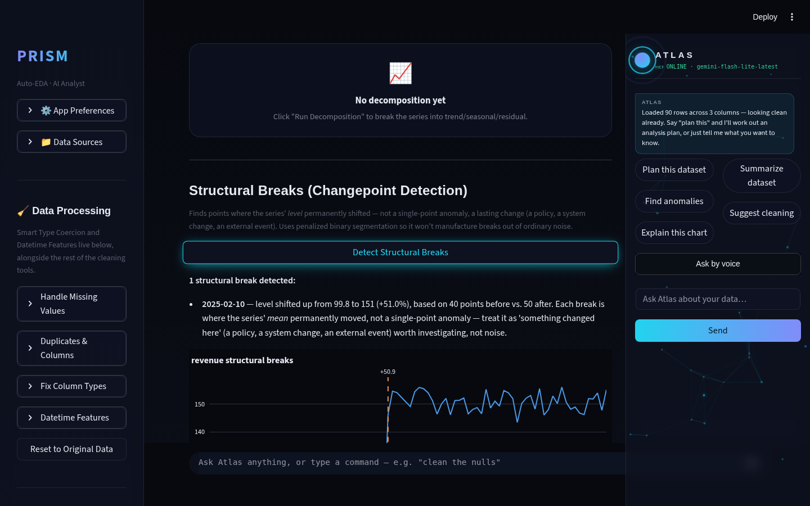
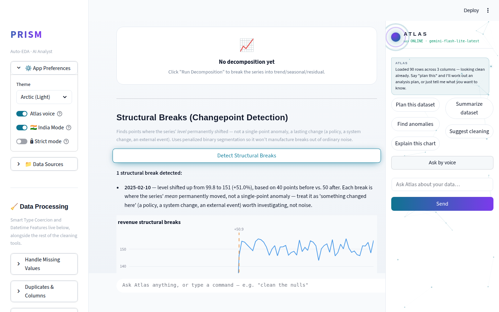
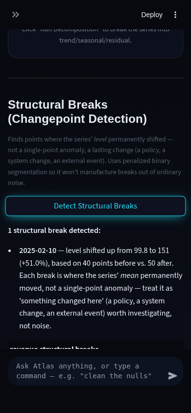
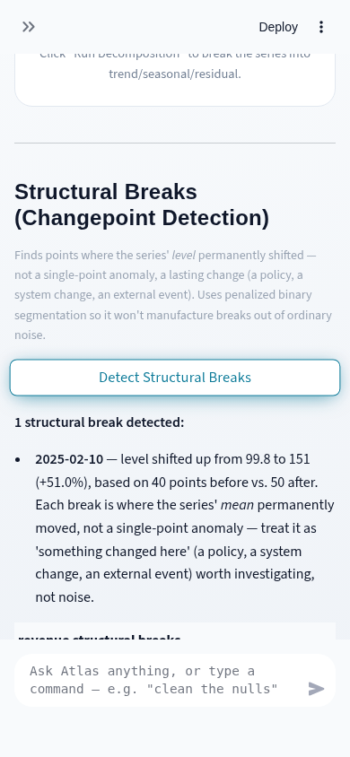

# Prism Autonomous Improvement Routine — Run 32 Report

**Date:** 2026-08-12
**Branch shipped from:** `feature/changepoint-detection` → merged to `main` (`--no-ff`)

## 1. What shipped

### Structural Break (Changepoint) Detection — Forecasting tab

**What it does:** Answers a question STL decomposition (shipped in an earlier
run) can't: not "what's the repeating seasonal pattern?" but "did this
metric's *level* permanently shift, and exactly when?" Given a datetime +
numeric column, `forecasting.detect_changepoints()` scans the series for
statistically meaningful mean shifts and reports each one's date, before/after
means, absolute delta, and percent change — with a chart marking each break.

**Why it was chosen:** This cycle's research pass (fresh grep of the
CHANGELOG and `modules/` against the "agentic AI analysis" theme
requirement) found the app already covers anomaly narration, hypothesis
suggestion, auto-insights, confounder/interaction cross-checks, and time
series decomposition extensively (31 prior runs). The one clear gap in the
Forecasting module specifically: no way to say "something changed here."
That's a real, commonly-asked applied-stats interview topic (structural
break / regime-shift detection), distinct in kind from what was already
built, so it didn't duplicate any shipped feature.

**Technical-depth argument:** Implemented as a from-scratch binary
segmentation algorithm (Scott & Knott, 1974 — the same greedy-split idea
underlying the `ruptures`/`changepoint` R and Python packages' `Binseg`
estimator), with a BIC-style penalty (`penalty_scale · σ² · ln(n)`) as the
stopping rule, deliberately avoiding a new pip dependency for a technique
numpy alone can express. Each candidate split point is scored in O(n) — not
the naive O(n²) — via a prefix-sum identity (`SS = Σx² − (Σx)²/n`), so the
detector stays fast on large uploads. The global step loop re-evaluates
every open segment and greedily accepts the single strongest split each
round (true best-first binary segmentation, not a depth-first shortcut that
would bias toward whichever branch happens to recurse first). This is the
kind of "explain the algorithm, not just call a library" depth a hiring
panel can dig into.

### Bundled fix: `prepare_series()` silently discarded data on any fresh CSV upload

**What was wrong:** `prepare_series()` — shared by the forecast, STL
decomposition, and new changepoint features — builds its time series by
grouping on the datetime column, then calling `Series.asfreq()` to make the
index regularly spaced. `asfreq()` requires an actual `DatetimeIndex`; fed
an `object`/string index instead, it doesn't raise — it silently reindexes
to an all-`NaN` series. And `object` dtype is the *default* state for any
CSV's date column: `data_engine.detect_column_types()` only *labels* a
column "datetime" by content heuristic, it never coerces the DataFrame
itself. Only a separate, manual "Fix Column Types" step in the sidebar
converts it. Net effect: the entire Forecasting tab was quietly dead —
producing plausible-looking-but-wrong output ("shifted from nan to nan")
rather than an error — for the common case of a dataset that hadn't been
run through that manual step first.

**How it was found:** Not a repro from the audit phase — it surfaced live,
mid-verification, while Playwright-testing the new changepoint feature
against a planted dataset. The expected single break at the planted date
instead showed up as five spurious tiny breaks with `nan` means, which is
what pointed straight at the shared `prepare_series()` path.

**The fix:** Coerce the datetime column via `pd.to_datetime(..., format="mixed")`
at the top of `prepare_series()` if it isn't already a real datetime dtype,
with a clear error message if nothing in it parses. Two regression tests
added (`tests/test_forecasting_stl.py`) — one proving the string-dtype path
now works end-to-end, one proving an unparseable column still errors
cleanly instead of silently returning garbage.

## 2. Verification

- **Tests:** full suite 579 → 595 green (16 new for changepoints, 2 new
  regression tests for the `prepare_series()` fix), zero regressions.
- **Screenshots** (`.prism/runs/2026-08-12-run32/`): desktop (1440×900) and
  mobile (390×844), dark and light, all four against a planted 90-day
  series with a +51% level shift at day 40. All four show "1 structural
  break detected... 2025-02-10... shifted up from 99.8 to 151 (+51.0%)" —
  the exact planted signal — with clean text wrapping, no clipping, and
  correct contrast in both themes.

| Desktop dark | Desktop light |
|---|---|
|  |  |

| Mobile dark | Mobile light |
|---|---|
|  |  |

- **Post-merge:** full suite re-run green on `main`; `main` pushed to
  `origin`; fresh-checkout boot confirmed (`streamlit run app.py` → HTTP
  200, no traceback).

## 3. Research findings not built (backlog for future runs)

| Candidate | Why not this run | Effort | Theme |
|---|---|---|---|
| PyGWalker-style drag-and-drop chart builder | Carried ~20 runs; L-effort, architecture-adjacent, repeatedly deprioritized in favor of smaller, verifiable slices | L | Visualize |
| Unify Gemini client construction (`ai_analyst.get_model()` / `get_sql_model()` / `atlas._client()`) | S-effort cosmetic cleanup, no evidenced bug — not worth a run's feature slot over a real gap | S | Code health |
| Audit other modules for the same "trusts a datetime *label* without coercing dtype" bug class | Surfaced by this run's fix; `datetime_intel.py`, `drift.py`, and the Visualize tab's own local `pd.to_datetime` call are the most likely places the same class of bug could recur | S | Correctness |
| Live-Gemini end-to-end verification | 15th consecutive run flagging this — this sandbox has no network path to the real Gemini API, a structural constraint, not a skipped task | — | — |

## 4. Interview notes (STAR-style, verbatim-usable)

**Structural break detection:**
> "I noticed Prism's forecasting module could decompose a time series into
> trend and seasonality, but had no way to flag a *permanent* shift in a
> metric's level — the kind of question a stakeholder actually asks
> ('what happened to revenue in March?'). I implemented binary segmentation
> from scratch — the same algorithm behind the `ruptures` package's Binseg
> estimator — with a BIC-style penalty so it wouldn't manufacture false
> breaks from noise, and vectorized the cost function with a prefix-sum
> identity to keep it O(n) instead of O(n²) per split, so it stays fast on
> large datasets. I validated it against synthetic data with planted single
> and multiple level shifts before trusting it on real data."

**The `prepare_series()` bug:**
> "While live-testing my new feature against a planted dataset, the output
> looked wrong — spurious breaks with `NaN` values instead of the one clean
> shift I'd planted. I traced it to a shared data-prep function that
> silently discarded every value when the datetime column hadn't been
> explicitly type-coerced, which was actually the default state for any
> freshly uploaded CSV — meaning three shipped features had likely been
> silently broken in the common case for a while. I fixed the root cause
> once, in the shared function, rather than patching around it in my new
> code, and added regression tests so it can't regress silently again."

## 5. Recommendation for next run

Two directions, in priority order:

1. **Correctness sweep for the same bug class.** This run's fix pattern
   (a column labeled with a type by a detector that never coerces the
   underlying dtype) is a structural risk, not a one-off. A focused audit
   of `datetime_intel.py`, `drift.py`, and any other module consuming
   `column_types`-labeled "datetime" columns directly would either close
   this out or surface more of the same class — cheap to check, high
   value if it finds something, and it's the kind of defensive-engineering
   story that reads well in an interview regardless of outcome.
2. **A second agentic-EDA slice building on today's changepoint work** —
   e.g., wiring `detect_changepoints()` into the Insight Orchestrator so a
   detected break surfaces proactively (Atlas-track eligible, capped at one
   slice/run) instead of requiring a manual "Detect Structural Breaks"
   click, mirroring the same "fewer manual steps per insight" pattern Run
   27's research already validated for `Run Full Analysis`.
